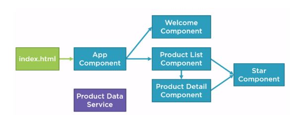

# Bloomfield2020Jan

This project was generated with [Angular CLI](https://github.com/angular/angular-cli) version 8.3.22.

## Development server

Run `ng serve` for a dev server. Navigate to `http://localhost:4200/`. The app will automatically reload if you change any of the source files.

## Code scaffolding

Run `ng generate component component-name` to generate a new component. You can also use `ng generate directive|pipe|service|class|guard|interface|enum|module`.

## Build

Run `ng build` to build the project. The build artifacts will be stored in the `dist/` directory. Use the `--prod` flag for a production build.

## Running unit tests

Run `ng test` to execute the unit tests via [Karma](https://karma-runner.github.io).

## Running end-to-end tests

Run `ng e2e` to execute the end-to-end tests via [Protractor](http://www.protractortest.org/).

## Further help

To get more help on the Angular CLI use `ng help` or go check out the [Angular CLI README](https://github.com/angular/angular-cli/blob/master/README.md).

------

<b>프로젝트 구조</b>

<b>프로젝트 언어 : TypeScript</b>

<b>앵귤러 개념</b>

Angular = Modules + Components

Component = Template + Class + Metadata

Class = Properties + Methods

Directives : HTML 요소에 동적인 기능이나 동작을 추가할 수 있게 하는 Angular 구성요소

- **Custom Directive** ex) <pm-product>
- **Built-In Directive** : *ngif, *ngfor

Pipes: 템플릿의 데이터를 우리가 원하는 방식으로 가공해서 보여줄 수 있는 기능

Methods : 클래스 안에 생성이 가능하고, `function` 키워드를 넣을 필요 없음 (ES2015 문법)

Mocks&Model

- `const` : 해당 변수의 내용이 재정의 되지 않도록 설정 (ES2015)
- `ngOnInit()` : 해당 컴포넌트가 생성되고 나면 바로 실행된다. 따라서, 프로퍼티 값을 초기화하기에 가장 안성맞춤인 장소. 컴포넌트 내의 다른 장소에서 프로퍼티 값 초기화도 가능하지만, 테스트하기에 어려움이 있다. 따라서 ngOnInit 에서 초기화 하도록 한다.

Services : 앱의 코드를 공유하거나 구성하는데 사용되고, 주로 데이터 접근 메서드를 생성할 때 사용한다.

binding

- Interpolation {}

- Property Binding []
- Event Binding ()
- Two-way Binding ( Property Binding + Event Binding)

Dependency Injection 은 서비스를 생성하고 클래스에 보낼 때 사용된다. DI 에 Provider 를 제공함으로써 어떤 클래스가 서비스 생성이 필요한지를 알 수 있다.

DI 에 Providers 를 등록하는 법

1. 주입할 수 있는 데코레이터를 Service 에 추가
2. 인젝터에 서비스를 프로바이더로 명명하여 알게한다
3. 디펜던시를 ts 파일에 주입한다.

<b>앵귤러 동작</b>

1. index.html 로딩 : <pm-root>을 포함하고 있고, main.ts 를 호출
2. main.ts 로딩 : 첫번째 컴포턴트를 호출하고, 전체 앱을 부트스트래핑
3. app.component.ts : 첫번째 컴포넌트이자, 헤더를 로딩한다. 그리고 이하 컴포넌트들을 로딩한다.

